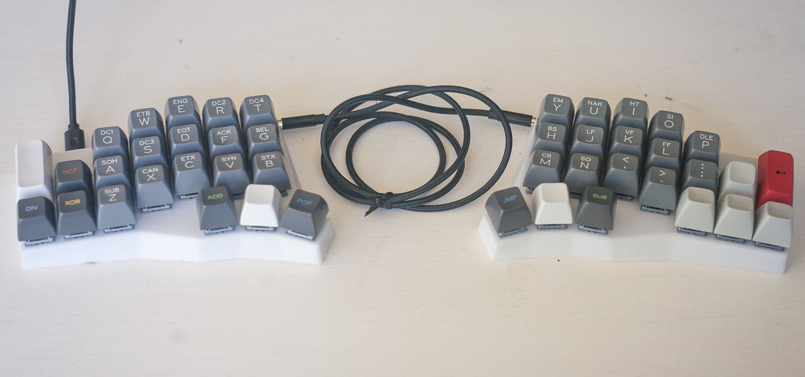

# Shifty Split Keyboard

## 📻 Project Description

Yet another 44-key handwired split keyboard. 

I liked the [Void Ergo S](https://github.com/victorlucachi/void_ergo), but I want to try a Corne style keyboard with a (semi-)dedicated arrow cluster, like the [Frame-48](https://github.com/gregsqueeb/Frame-48). I also added a vertical 2u key on each end where the numpad Enter key would be on a full-size keyboard, because of muscle memory, partially inspired by the [Skean's](https://github.com/krikun98/Skean) outer keys.

[Continue reading...](notes/Design.md)

## 🧰 Features

- 22×2 keys
- 2× RP2040 microcontrollers w/ USB-C on each side
- Split via TRS cable
- Powered by QMK with Vial support

## 📚 Read more...
- [Design](notes/Design.md)
- [Construction](notes/Construction.md)
- [Firmware](notes/Firmware.md)
- [Gallery](notes/Gallery.md)

## 🙏 Inspired by...
- [VOID Ergo S by Victor Lucachi](https://github.com/victorlucachi/void_ergo)
- [Frame-48 by Greg Mathews](https://github.com/gregsqueeb/Frame-48)
- [Skean by Alexander Krikun](https://github.com/krikun98/Skean)
- [MicroDox by Stephen Onnenon](https://github.com/onnenon/microdox-case/)
- [Unicorne by Boardsource](https://new.boardsource.xyz/products/unicorne)

## 📐 References
- [RP2040-Zero by Waveshare](https://www.waveshare.com/rp2040-zero.htm)
- [QMK Firmware](https://docs.qmk.fm/)
- [Vial Firmware](https://get.vial.today/)

---