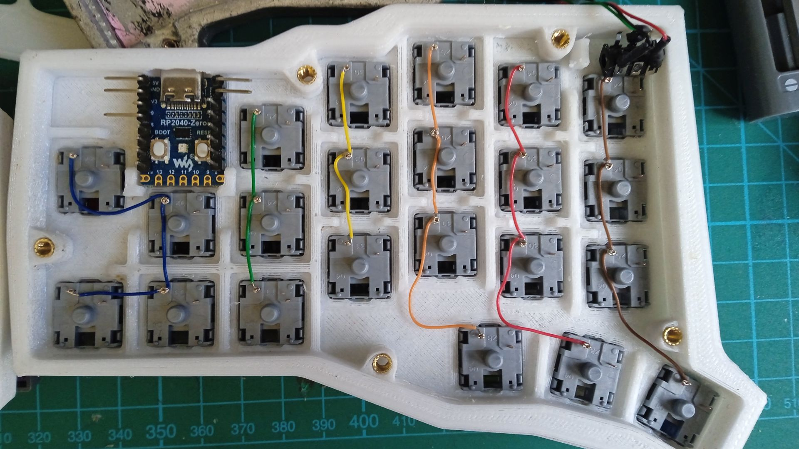
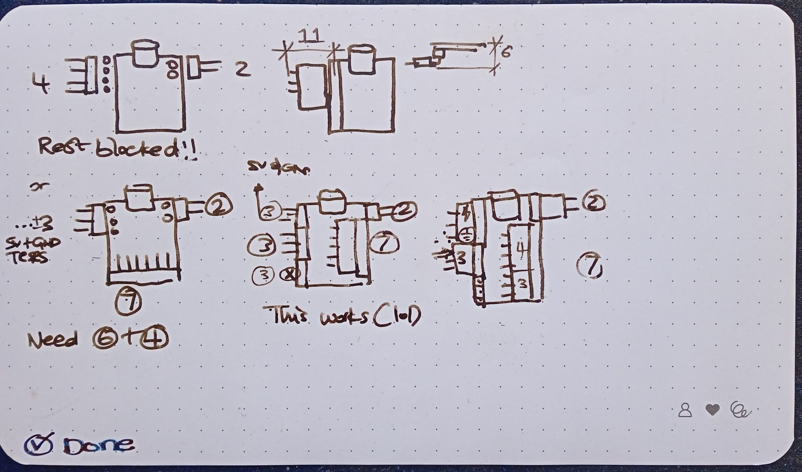
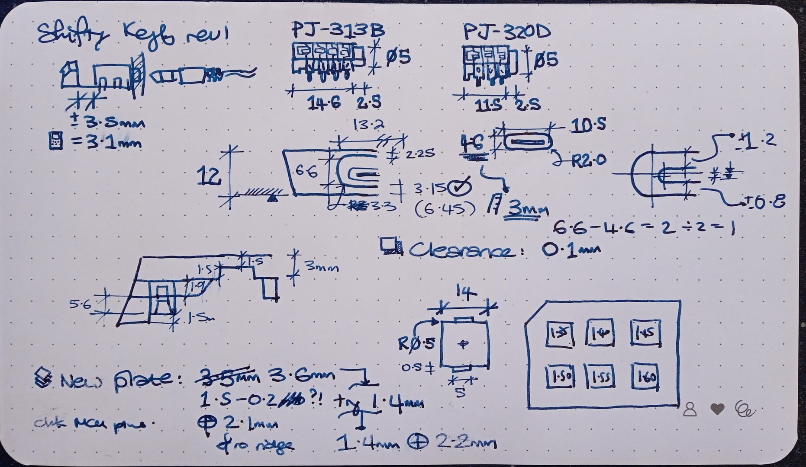

# Construction

## 🛒 Bill of Materials (BOM)

| Item | Size | Qty | 
| ---- | ---- | --- |
| [Waveshare RP2040-Zero](https://www.waveshare.com/rp2040-zero.htm) | N/A | 2 |
| Switches | MX | 44 |
| Diodes, 1N4148 | 1N4148 | 44 |
| PJ320D 3.5mm Female | TRS† | 2|
| Heat Set Inserts | M3 ø4x5mm | 10 |
| Screws, countersunk | M3 | 10 |
| Wire | 30AWG | N/A |
| 3D printed shell | N/A | 4 pcs |

† Test the cable(s) you intend using, as TRS and TRRS connectors are not always compatible.

## 📸 Photos
I didn't take many photos during the build of this one. The biggest challenge is the tight spacing around the MCU, as can be seen below:

Note the 90 degree header pins next to the USB-C port. These are for 3v3, GND, and a serial pin for the split cable between the halves. For this I decided to use a battery header pins because they're sturdier than the usual 30AWG wire I use that *does* tend to come loose on occasion.

For the switches, the balance of the pins are vertical pins. I revised the height of the case so that the height of the case is barely just enough to contain them, althought the ends might need to be trimmed with wire cutters.

For this build I greatly recommend using a wire wrapping tool, it was a complete life changer. 

My previous method was to attach female headers on to the MCU's pins, manually wrap 30AWG wire around each pin, solder it, then cover it in insulation tape. 

Using a wire wrapping tool is much less bulky than a pair of male and female header sockets, and they can be removed without needing to desolder. So far the connection has been sturdy enough for every day use, though bear in mind I leave this keyboard at home and don't travel with it.

After the first print I refined some dimensions, mostly the USB-C and TRS cutouts on the case.

---
Back: [Design](Design.md) | Next: [Firmware](Firmware.md) | Back to [README.md](../README.md)