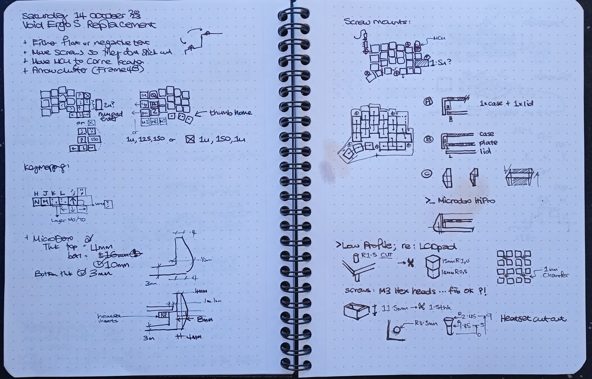
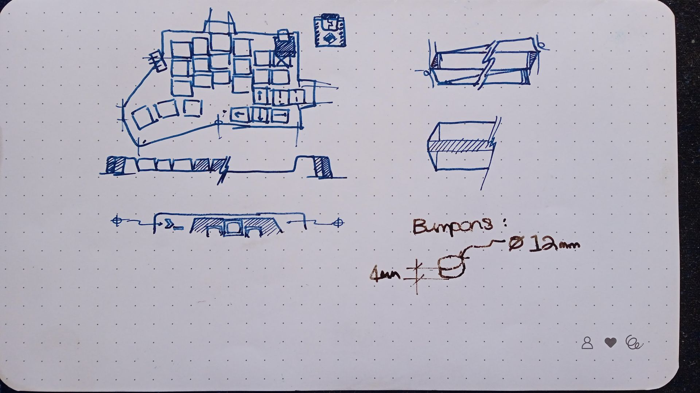

# Design
Yet another 44-key handwired split keyboard. 

I liked the [Void Ergo S](https://github.com/victorlucachi/void_ergo), but I want to try a Corne style keyboard with a (semi-)dedicated arrow cluster, like the [Frame-48](https://github.com/gregsqueeb/Frame-48). I also added a vertical 2u key on each end where the numpad Enter key would be on a full-size keyboard, because of muscle memory, partially inspired by the [Skean's](https://github.com/krikun98/Skean) outer keys.

The arrow clusters line up nicely with the 5th and 6th column from the Void Ergo (same Y offset), and this conveniently leaves an empty key where the top row 6th column key would normally be, which is just enough space to fit a small RP2040 MCU. 

For the outer easy key, I chose a vertical 2u key because of years of muscle memory hitting the number pad Enter key. I was considering placing it horizontally, but I wasn't happy with the resulting silhouette of the keyboard, so I stuck to the current layout.

It's 3D printed and handwired. The plate and the case are one part to avoid having to hassle with heatsets and screws. The bottom plate is recessed inside the walls of the top case, to hide imperfections with clearance and tolerance between the two parts. Then, I added a generous amount of slope and loft to the walls of the case to break up the silhouette because that appeals my personal taste.

As for the name? I needed something to put where the empty key was, so I decided to add a `>_>` face.

---

Next: [Construction](Construction.md) | Back to [README.md](../README.md)